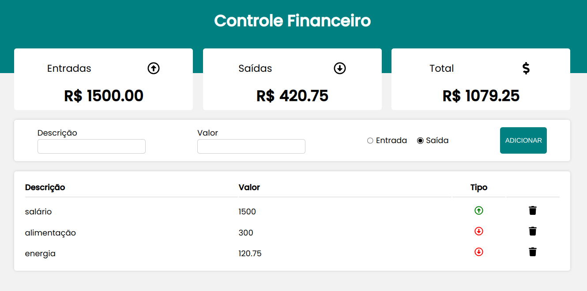

  <a href="#-tecnologias">Tecnologias</a>&nbsp;&nbsp;&nbsp;|&nbsp;&nbsp;&nbsp;
  <a href="#-projeto">Projeto</a>&nbsp;&nbsp;&nbsp;|&nbsp;&nbsp;&nbsp;
  <a href="#-como-rodar">Como rodar</a>&nbsp;&nbsp;&nbsp;|&nbsp;&nbsp;&nbsp;
  <a href="#-como-contribuir">Como contribuir</a>&nbsp;&nbsp;&nbsp;
  

 

  

## Finance Control

## 🚀 Tecnologias

Esse projeto foi desenvolvido com as seguintes tecnologias:

- [ReactJS](https://reactjs.org/)
- [Styled-components](https://styled-components.com/)
- [Nodejs](https://nodejs.org/en/) - 18.12.1
- [NPM](https://www.npmjs.com/) - 8.19.2

## 💻 Projeto

Projeto de um sistema de controle de finanças.

Aula do canal [Will Dev](https://www.youtube.com/watch?v=pj4vA67olbU)

## 🚀 Como Rodar

- Clone o projeto;
- Entre na pasta do projeto e rode npm install (use yarn install se for de acordo com a sua configuração);
- npm start;

## 🤔 Como contribuir

- Faça um fork desse repositório;
- Cria uma branch com a sua feature: `git checkout -b minha-feature`;
- Faça commit das suas alterações: `git commit -m 'feat: Minha nova feature'`;
- Faça push para a sua branch: `git push origin minha-feature`.

Depois que o merge da sua pull request for feito, você pode deletar a sua branch.

## 📝 Licença

Esse projeto está sob a licença MIT.